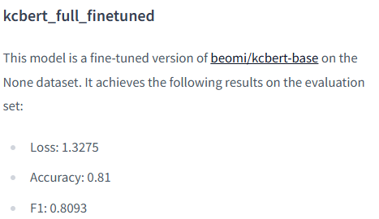
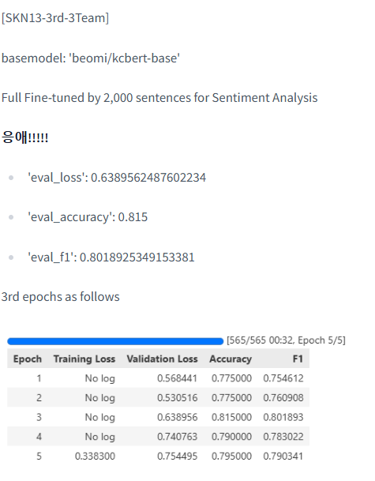
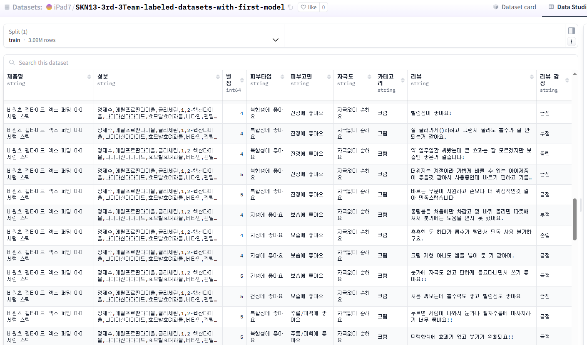

# SKN13-3rd-3Team 전처리 결과서

담당자: 이유나, 이재범

## 원본 데이터

* 올리브영 스킨케어 제품 리뷰 크롤링 데이터: 총 984,740건

* 총 19개의 특징 추출:

    > '제품명', '이미지 URL', '내용물의 용량 또는 중량', '제품 주요 사양', '사용기한', '사용방법', '제조업자 등', '제조국', '성분', '기능성 여부', '주의사항', '품질보증기준', '소비자상담', '리뷰 ID', '별점', '피부타입, '피부고민', '자극도', '리뷰'

* 제품 카테고리 별 데이터 명세

    * oliveyoung_cream_*.csv

        * 총 690개의 크림 제품 수집

        * shape: (342479, 19)

    * oliveyoung_essence_*.csv

        * 총 774개의 에센스/세럼/앰플 제품 수집

        * shape: (379115, 19)

    * oliveyoung_lotion.csv

        * 총 236개의 로션 제품 수집

        * shape: (85432, 19)

    * oliveyoung_mist.csv

        *총 84개의 미스트/오일 제품 수집

        * shape: (37266, 19)

    * oliveyoung_skin.csv

        * 총 358개의 스킨/토너 제품 수집

        * shape: (140448, 19)

## 주요 요구사항

1. 이상치 및 결측치 처리

2. 데이터 정제(불필요한 단어 및 특수문자)

3. `Document.metadata` 태깅을 위한 처리

    * 제품 **카테고리**

    * 리뷰의 **감성(Sentiment)**

## 세부 항목

### 1. preprocessing.ipynb: 토크나이징 이전 기본적인 전처리

* 불필요한 열 처리: '품질보증기준', '사용기한', '제조국', '제조업자 등' 등

* '카테고리' 열 추가

* 리뷰가 100개 미만인 제품을 이상치로 간주하여 삭제

* '별점'을 정수형으로 변환

    > '5점 만점에 4점'  -> 4

* 데이터 정제: 불필요한 특수 문자 제거 및 중복되는 제품명을 하나의 제품으로 통일

---

### 2. prep.ipynb: 문장 단위 토크나이징

* `kss` 라이브러리 기반 토크나이징: `kss.split_sentences`

---

### 3. Sampling.ipynb

* 상품 카테고리 별 리뷰 비율 최대한 반영하여 총 2천 문장의 학습 표본 추출

    > 크림 600개, 에센스 600개, 로션 200개, 미스트 200개, 스킨 200개

* 데이터 라벨링: `GPT-4.1`-based Few-shot Learning

```py
class Sentiment(BaseModel):
    sentiment: str = Field(description="분석된 감성. '긍정', '부정', '중립' 중 하나의 값이어야 합니다.")

template = """
당신은 한국 화장품 리뷰의 감성을 분석하는 최고의 전문가입니다.
주어진 문장을 분석하여 '긍정', '부정', '중립' 중 하나로 분류해주세요.

# 감성 분류 기준:
- "긍정": 제품에 대한 만족, 칭찬, 추천, 재구매 의사 등 긍정적인 내용.
- "부정": 제품에 대한 불만, 단점, 비판, 부작용 등 부정적인 내용.
- "중립": 객관적인 사실 전달(예: 제형, 색상 설명), 긍/부정이 혼재되어 판단이 어려운 문장. 배송, A/S 등 서비스 품질 및 제품 용기의 품질이나 외관 등, 제품 자체의 성능에 대한 판단이 아닌 문장.

{format_instructions}

# 분석할 문장:
{review_sentence}
"""
```

---

### 4. FullFineTuning.ipynb

* `beomi/kcbert-base` 모델에 `리뷰-감성` 샘플 기반 Full Fine-tuning

* HuggingFace Hub로 관리

    * [iPad7/kcbert-base-sentiment-0.1b](https://huggingface.co/iPad7/kcbert-base-sentiment-0.1b)

    * [iPad7/kcbert_full_finetuned](https://huggingface.co/iPad7/kcbert_full_finetuned)
    
* 학습 결과





---

### 5.  sentiment_prediction.ipynb

* Fine-tuned 모델 별로 전체 데이터셋의 감성을 추론

* Final Model:`iPad7/kcbert_full_finetuned`

    > 표본 내 검증 데이터셋에서 비교적 높은 오차를 보여주나, 실제 데이터셋에서 추론한 결과를 인간의 눈으로 정성 평가한 결과 해당 모델이 우수한 성능을 보임

* 추론 결과를 '리뷰_감성' 열에 추가한 담은 최종 테이블 데이터를 HuggingFace Hub에 업로드

## 최종 데이터

* [iPad7/SKN13-3rd-3Team-labeled-datasets-with-first-model](https://huggingface.co/datasets/iPad7/SKN13-3rd-3Team-labeled-datasets-with-first-model)



    * 약 309만 개 데이터

    * 각 데이터포인트의 '리뷰' 값은 실제 리뷰 속의 1개 문장

    * 총 9개의 특징으로 요약

        > '제품명', '성분', '별점', '피부타입', '피부고민', '자극도', '카테고리', '리뷰', '리뷰_감성'