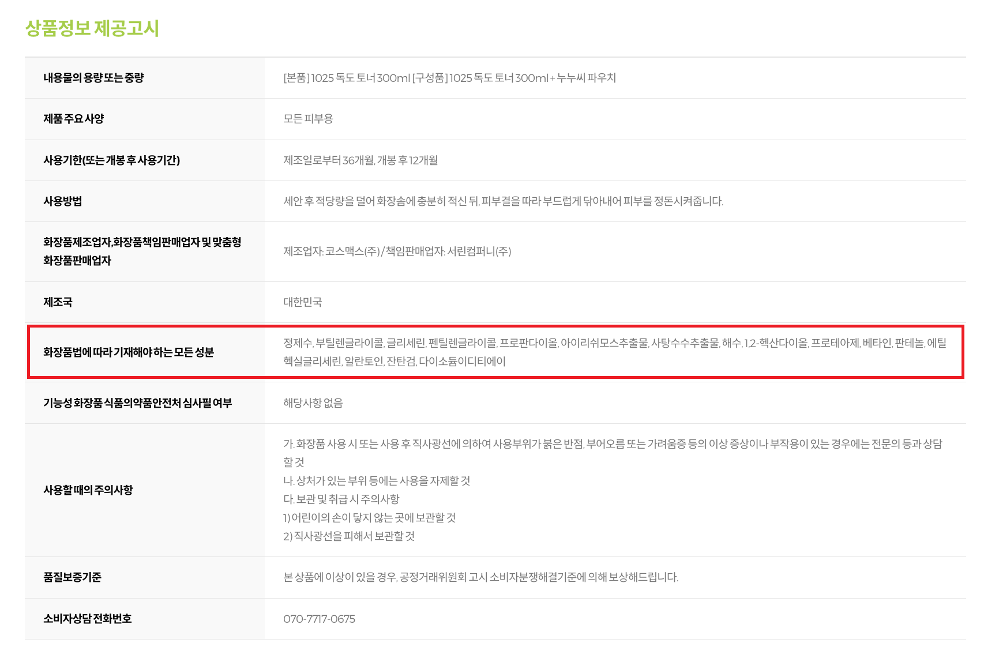

# SKN13-3rd-3Team

## 1. Introduce Team
### 💡 프로젝트명: 기초 화장품 추천 챗봇 
 – 내 피부에 맞는 기초화장품을 빠르게, 똑똑하게 추천해주는 리뷰 기반 AI 챗봇
  
#### 꼬꼬마팀
<table align=center>
  <tbody>
   <tr>
      <td align=center><b>이유나</b></td>
      <td align=center><b>이재범</b></td>
      <td align=center><b>장진슬</b></td>
      <td align=center><b>지형우</b></td>
    </tr>
    <tr>
      <td align="center">
          
      </td>
      <td align="center">
          
      </td>
      <td align="center">
        
      </td>
      <td align="center">
        
      </td>
    </tr>
    <tr>
       <td align="center">
       
       </td>
       <td align="center">
       
       </td>
       <td align="center">
       
       </td>
       <td align="center">
       
       </td>
    </tr>
  </tbody>
</table>
 
  

## 2.1 Project Overview - 프로젝트 소개

🧐 **"생각해보지 않았지만 우리 모두의 불편함 : 내 피부에 맞는 기초 화장품 찾기가 어렵다!"**  

💄 화장품을 구매하려고 올리브영 오프라인 혹은 온라인 매장을 방문하면, 수 많은 제품들에게 압도당해 어떤 제품이 내 피부에 맞는지 판단하기 힘들다. 

> 😟 새로운 제품을 시도할 때 실패에 대한 불안과 기회비용, 시간의 부담 발생 
> 🎥 유튜브 ‘추천템’은 광고성 비중이 커 신뢰도 낮고, 탐색 비용이 큼 

  
  

📊 올리브영 스킨케어 제품에 대한 데이터를 크롤링해서 132만 건 수집, 감성분석을 진행하여 최종적으로 309만 건의 데이터 구축  

🧠 **LLM 기반 RAG(Retrieval-Augmented Generation)** 구조로 **기초 화장품 추천 챗봇**을 구현.  

> 사용자의 **피부타입, 피부고민, 선호제형, 민감도**등 다양한 조건을 바탕으로 사용자의 피부 조건에 맞는 제품 추천 및 리뷰 요약, 트렌드, 사용자 불만 요소까지 제공  
 

✔️ **신뢰할 수 있는 실제 사용자 리뷰 기반**의 추천을 통해 개인의 피부에 맞는, **더 나은 화장품 선택 경험을 제공**을 목표  

  

## 2.2 프로젝트 목표

### 2.2.1 ⚙️ 기술적 목표
1. 최신 리뷰 데이터 기반 RAG 챗봇
  - 올리브영 스킨케어 리뷰를 크롤링하여 벡터DB를 구축하고, 이를 RAG(Retrieval-Augmented Generation)기반 질의응답형 추천 챗봇으로 구성  

2. 감성 분석을 통한 리뷰 데이터 재구성, 세분화된 메타데이터로 LLM 응답 정밀도 향상
  - 한국어 리뷰를 문장 단위로 분석하여 긍·부정 감정 및 주요 키워드를 자동 태깅, LLM 기반 응답의 정밀도 향상
  - 피부타입, 고민, 자극도 등 의미 있는 속성을 메타데이터로 추출하고, 유사도 기반 벡터 검색과 함께 정밀한 필터링 제공 
 

### 2.2.2 👤 사용자 가치 목표
1. 피부 타입과 상황에 맞는 개인 맞춤형 제품, 대체제 추천 제공
  - “지성 피부에 진정 효과 좋은 수분크림 추천해줘”와 같은 구체적인 요청에 적합한 제품을 빠르게 추천 
  
2. 소비자의 탐색비용 절감, 신뢰 기반 제품 선택 경험 제공
  - 반복적이고 비효율적인 탐색 과정을 챗봇 한 번의 질의로 대체
  - 리뷰 기반의 객관적 정보에 따라 합리적인 제품 선택을 유도
 

### 2.2.3 🛠️ 사용한 기술 스택
  

  
  
  

  
  
  

  
  
  

  

  

--------------------------------------------
## 3. System Architecture

  

--------------------------------------------

## 4. Preprocessing
### 4.1 cleansing, outliers, and missing values 🧽

1. 이상치 및 결측치 처리, 열 삭제/추가
    - 리뷰 100개 미만 제품 제거
    - 불필요한 열('품질보증기준', '사용기한', '제조국', '제조업자' 등)삭제, '카테고리' 열 추가
    - '별점'을 정수형으로 변환
2. 데이터 정제(불필요한 단어 및 특수문자)
    - ‘리필’ 또는 ‘기획’이 들어간 경우 데이터 포인트 자체를 제거
    - 괄호(`[]`, `()` 등)와 괄호 안의 문자열을 제거
    - 불필요한 특수 문자 제거 및 중복되는 제품명을 하나의 제품으로 통일
    - 문장 중간에 들어가는 기호('?') 제거 (정확한 토크나이징을 위해)
3. Document.metadata 태깅을 위한 처리
    - 제품 카테고리
    - 리뷰의 감성(Sentiment)

 

**전처리 결과 요약**

| 카테고리 | 전처리 전 (제품 수) | 전처리 전 (리뷰 수) | 전처리 후 (제품 수) | 전처리 후 (리뷰 수) |
|----------|--------------------|----------------------|---------------------|----------------------|
| 스킨/토너 (skin/toner)   | 358                | 140,448              | 170                 | 120,397              |
| 크림 (cream)            | 690                | 342,479              | 404                 | 286,631              |
| 에센스/세럼/앰플 (essence) | 774                | 379,115              | 424                 | 315,268              |
| 로션 (lotion)           | 236                | 85,432               | 116                 | 75,085               |
| 크림 (cream)            | 690                | 342,479              | 404                 | 286,631              |
| 미스트/오일 (mist/oil)    | 84                 | 37,266               | 47                  | 34,872               |
| **총합**                | **2,832**          | **1,327,219**          | **1,565**           | **1,118,884**          |

 

### 4.2 ✂️ entence-level tokenizing
  - kss 라이브러리 기반 토크나이징: **kss.split_sentences**로 문장 단위 분리 

 

### 4.3 🔍 Sampling
  - 상품 카테고리 별 리뷰 비율 최대한 반영하여 총 2천 문장의 학습 표본 추출
  > 크림 600개, 에센스 600개, 로션 200개, 미스트 200개, 스킨 200개
  - GPT-4.1-based Few-shot Learning으로 데이터 라벨링
    
 

### 4.4 🧠 FullFineTuning 
  - 모델 : beomi/kcbert-base 리뷰-감성 샘플 기반 Full Fine-tuning
  - 파인튜닝 결과물 (HuggingFace Hub로 관리)

    - iPad7/kcbert-base-sentiment-0.1b
    - iPad7/kcbert_full_finetuned
    
  > 본 프로젝트에서는 한국어 리뷰에 대한 감정 분류를 위해 iPad7/kcbert-base-sentiment-0.1b 모델을 활용
  > 이 모델은 한국어에 특화된 KcBERT 기반 감성 분류기로, 리뷰 데이터를 긍정/부정/중립으로 자동 분류

 

### 4.5 ❤️ Sentiment Analysis

1. Fine-tuned 모델 별로 전체 데이터셋의 감성을 추론
2. 표본에서 학습에 활용할 ground truth label(y_train)을 생성
3. HuggingFace Hub Pre-trained Sentiment Analysis 모델을 미세조정
    - `beomi/kcbert-base`, `klue/roberta-large`, `tabularisai/multilingual-semtiment-analysis` , etc.
    - LoRA(Low-Rank Adaptation) 
4. 전체 리뷰 데이터 라벨링 완료 

 

### 4.6 🧾 최종 데이터

* 총 309만 개 데이터 수집.
  > 각 데이터포인트의 '리뷰' 값은 실제 리뷰 속의 1개 문장
* 총 9개의 특징으로 요약
  > '제품명', '성분', '별점', '피부타입', '피부고민', '자극도', '카테고리', '리뷰', '리뷰_감성'

  

--------------------------------------------
## 5. Model

* 모델: HuggingFaceEmbeddings  
**model_name="jhgan/ko-sbert-nli"**  
  - 문장 수준 의미를 효과적으로 반영하는 한국어 임베딩 모델
  - Mean pooling을 활용하여 문장 수준 특징을 효과적으로 집계

  

--------------------------------------------
## 6. Vector DB

* 💽 DB 선택: Chroma에서 **FAISS**로 전환
309만 건이라는 대용량 데이터를 다루는 상황에서, Chroma는 프로토타입 단계에서는 유용했지만 실질적인 성능에 한계가 존재. 
고성능, 확장성, 속도, 효율성 측면에서 모두 우수한 FAISS를 벡터 데이터베이스로 최종 선택

- Chroma 대비 벡터 삽입 속도가 약 3~5배 빨라졌으며, 검색 속도는 10배 이상 개선됨
- 검색 정확도와 일관성도 동일 수준 이상을 유지

  

--------------------------------------------
## 7. RAG-based QA Chatbot 구현 

형우 챗봇 구현 캡쳐 올리기 

### How to Use
💻 사용자 인터페이스 <화면 캡쳐>

💬 Step 1. 질문 입력
ex) “건성 피부에 진정 잘 되는 크림 5개 추천해줘”  
ex) “트러블 나지 않는 수분크림 중 인기 많은 거 있어?”

💬 Step 2. 후속 질문
ex) "여기서 안끈적거리는 제품 알려줘"
ex) "이 제품들 중 '보습력'을 가장 긍정적으로 평가한 제품은 뭐야?”


💬 Step 3. 답변 생성
- 제품명 + 간단한 설명 + 긍/부정 요약
- 비슷한 제품, 대체제 등 추가 정보 포함

  

--------------------------------------------
### 8. 확장 가능성 및 향후 활용 방향

* 적용 범위 확대 가능
  - 올리브영 내 다른 카테고리 (바디케어, 헤어케어, 색조 화장품 등)
  - 패션, 생필품, 전자기기 등 다양한 소비재 영역

* 향후 확장 방향
  - 이커머스, 브랜드 마케팅, 소비자 리서치 등 다양한 분야에 활용

  

  
  

