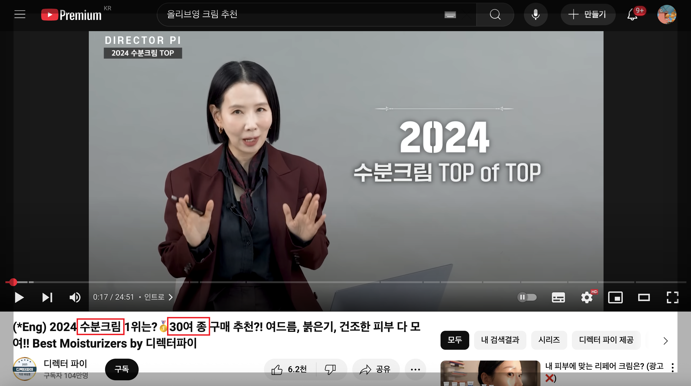
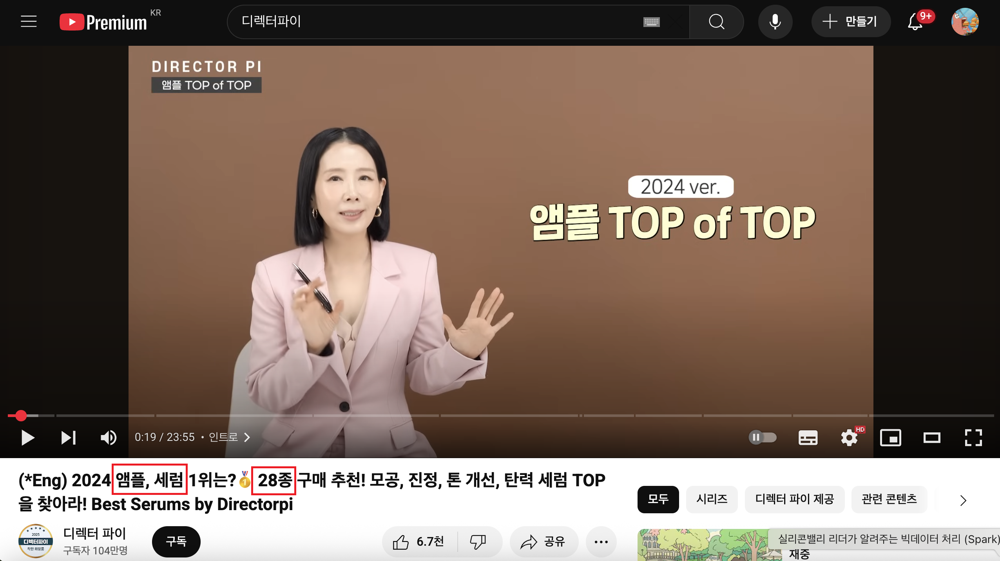
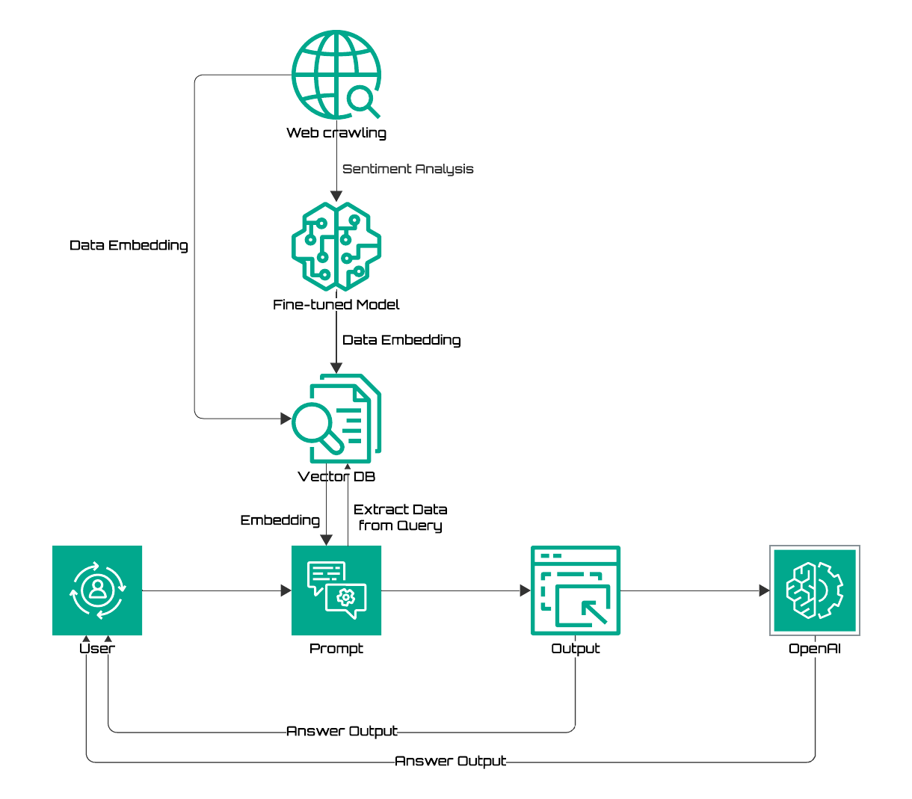
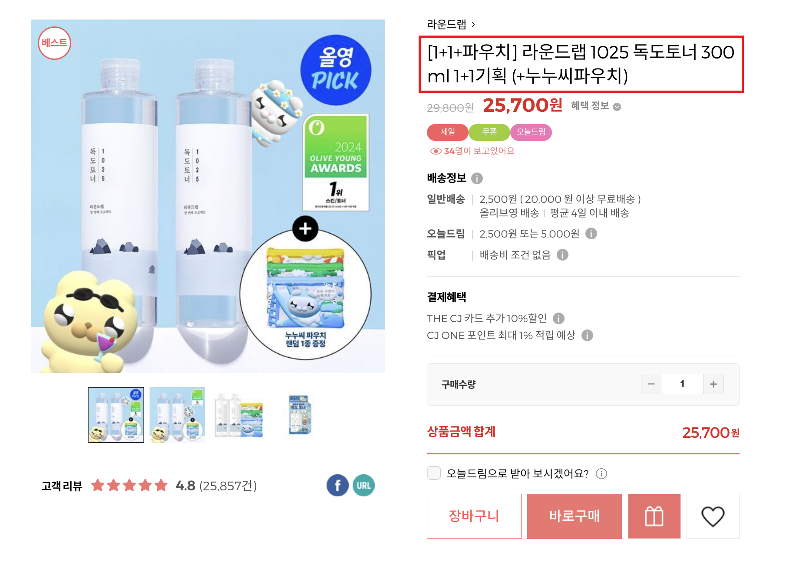

# SKN13-3rd-3Team
[SK Networks Family AI Camp 13th] 3rd mini project

## 1. Introduce Team
### 💡 프로젝트명:
"_____” – 내 피부에 맞는 기초화장품을 빠르게, 똑똑하게 추천해주는 리뷰 기반 AI 챗봇

<table align=center>
  <tbody>
   <tr>
      <td align=center><b>이유나</b></td>
      <td align=center><b>이재범</b></td>
      <td align=center><b>장진슬</b></td>
      <td align=center><b>지형우</b></td>
    </tr>
    <tr>
      <td align="center">
          
      </td>
      <td align="center">
          
      </td>
      <td align="center">
        
      </td>
      <td align="center">
        
      </td>
    </tr>
    <tr>
       <td align="center">
       
       </td>
       <td align="center">
       
       </td>
       <td align="center">
       
       </td>
       <td align="center">
       
       </td>
    </tr>
  </tbody>
</table>
 
  

## 2. Project Overview - 프로젝트 소개

**"생각해보지 않았지만 우리 모두의 불편함 : 내 피부에 맞는 기초 화장품 찾기가 어렵다!"**  

화장품을 구매하려고 올리브영 오프라인 혹은 온라인 매장을 방문하면, 수 많은 제품들에게 압도당해 어떤 제품이 내 피부에 맞는지 판단하기 어렵습니다. 
특히 새로운 제품을 시도할 때 실패에 대한 불안과 기회비용, 시간의 부담이 발생합니다.  
많은 소비자들은 유튜브에서 '추천템'을 보고 제품을 구매하는데, 상업적, 광고성 콘텐츠가 비중이 커서 신뢰하기 어렵고, 원하는 조건의 제품을 찾기 위해서는 다수의 영상을 하나하나 시청해야하는 높은 탐색 비용이 발생합니다.  

  
  

이에 우리 팀은 올리브영 스킨케어 제품에 대한 데이터를 크롤링해서 98만 건 수집했고, 감성분석을 진행하여 최종적으로 309만 건의 데이터를 수집하였습니다.  
그리고 **LLM 기반 RAG(Retrieval-Augmented Generation)** 구조로 구현된 **기초 화장품 추천 챗봇**을 구현했습니다.  

이 챗봇은 사용자의 **피부타입, 피부고민, 선호제형, 민감도**등 다양한 조건을 바탕으로 사용자의 피부 조건에 맞는 제품 추천 및 리뷰 요약, 트렌드, 사용자 불만 요소까지 제공합니다.  
 
이 프로젝트는 반복적인 검색과 제품 비교로부터 소비자의 피로도를 줄이고,  
**신뢰할 수 있는 실제 사용자 리뷰 기반**의 추천을 통해 개인의 피부에 맞는,  
**더 나은 화장품 선택 경험을 제공**하는 것을 목표로 합니다.  

## 프로젝트 목표

### 📌 기술적 목표
1. 최신 리뷰 데이터 기반 RAG 챗봇 서비스 구현
- 올리브영 스킨케어 리뷰를 크롤링하여 벡터DB를 구축하고, 이를 RAG(Retrieval-Augmented Generation)기반 질의응답형 추천 챗봇으로 구성   

2. 감성 분석을 통한 리뷰 데이터 재구성, 세분화된 메타데이터 
- 한국어 리뷰를 문장 단위로 분석하여 긍·부정 감정 및 주요 키워드를 자동 태깅, LLM 기반 응답의 정밀도 향상
- 피부타입, 고민, 자극도 등 의미 있는 속성을 메타데이터로 추출하고, 유사도 기반 벡터 검색과 함께 정밀한 필터링 제공   

### 🎯 사용자 가치 목표

1. 피부 타입과 상황에 맞는 개인 맞춤형 제품, 대체제 추천 제공
- “지성 피부에 진정 효과 좋은 수분크림 추천해줘”와 같은 구체적인 요청에 적합한 제품을 빠르게 추천 
- “이 제품 트러블 난다는 리뷰가 많은데 대체 제품은 뭐야?”에 대한 응답 처리   
  
2. 소비자의 탐색비용, 기회비용 을 절감하고, 신뢰할 수 있는 제품 선택 경험 제공
- 유튜브 영상, 후기 수집 등 반복적이고 비효율적인 탐색 과정을 챗봇 한 번의 질의로 대체  
- 리뷰 기반의 객관적 정보에 따라 합리적인 제품 선택을 유도  
- 실제 사용자들의 집단 지성을 바탕으로 한 정보로 제품 선택 신뢰도 향상  

--------------------------------------------
## 3. System Architecture

  

--------------------------------------------

## 4. Data Search
### Preprocessing - cleansing, outliers, and missing values

1. 이상치 및 결측치 처리, 열 삭제/추가
    - 리뷰 100개 미만 제품 제거
    - 불필요한 열('품질보증기준', '사용기한', '제조국', '제조업자' 등)삭제, '카테고리' 열 추가
    - '별점'을 정수형으로 변환
2. 데이터 정제(불필요한 단어 및 특수문자)
    - ‘리필’ 또는 ‘기획’이 들어간 경우 데이터 포인트 자체를 제거
    - 괄호(`[]`, `()` 등)와 괄호 안의 문자열을 제거
    - 불필요한 특수 문자 제거 및 중복되는 제품명을 하나의 제품으로 통일
3. Document.metadata 태깅을 위한 처리
    - 제품 카테고리
    - 리뷰의 감성(Sentiment)
      

### 📊 전처리 결과 요약

| 카테고리 | 전처리 전 (제품 수) | 전처리 전 (리뷰 수) | 전처리 후 (제품 수) | 전처리 후 (리뷰 수) |
|----------|--------------------|----------------------|---------------------|----------------------|
| 스킨/토너 (skin/toner)   | 358                | 140,848              | 170                 | 120,397              |
| 크림 (cream)            | 690                | 342,479              | 404                 | 286,631              |
| 에센스/세럼/앰플 (essence) | 774                | 379,155              | 424                 | 315,268              |
| 로션 (lotion)           | 236                | 85,432               | 116                 | 75,085               |
| 크림 (cream)            | 690                | 342,479              | 404                 | 286,631              |
| 미스트/오일 (mist/oil)    | 86                 | 38,627               | 47                  | 34,872               |
| **총합**                | **2,144**          | **986,541**          | **1,161**           | **832,253**          |

### Preprocessing - 문장 단위 토크나이징
- kss 라이브러리 기반 토크나이징: kss.split_sentences

### Preprocessing - Sampling
- 상품 카테고리 별 리뷰 비율 최대한 반영하여 총 2천 문장의 학습 표본 추출
  > 크림 600개, 에센스 600개, 로션 200개, 미스트 200개, 스킨 200개
- 데이터 라벨링: GPT-4.1-based Few-shot Learning

### Preprocessing - FullFineTuning 
- beomi/kcbert-base 모델에 리뷰-감성 샘플 기반 Full Fine-tuning
- HuggingFace Hub로 관리

    - iPad7/kcbert-base-sentiment-0.1b
    - iPad7/kcbert_full_finetuned

>> 본 프로젝트에서는 한국어 리뷰에 대한 감정 분류를 위해 iPad7/kcbert-base-sentiment-0.1b 모델을 활용하였습니다.  
>> 이 모델은 한국어에 특화된 KcBERT 기반 감성 분류기로, 리뷰 데이터를 긍정/부정/중립으로 자동 분류합니다.

### Preprocessing - 감성 분석 (Sentiment Analysis)

1. Fine-tuned 모델 별로 전체 데이터셋의 감성을 추론
2. 표본에서 학습에 활용할 ground truth label(y_train)을 생성합니다.
    - `gpt-4.1` 을 활용하여 LLM-based Few-shot Learning을 수행합니다.
    - `gpt-4.1`에 전달할 프롬프트가 굉장히 중요할 것 같습니다.
3. HuggingFace Hub Pre-trained Sentiment Analysis 모델을 미세조정합니다.
    - `beomi/kcbert-base`, `klue/roberta-large`, `tabularisai/multilingual-semtiment-analysis` , etc.
    - LoRA(Low-Rank Adaptation)
4. 전체 데이터의 label을 예측합니다.
 

메타데이터 생성: 키워드 + 감정분석 기반 메타 태깅 (피부타입, 고민, 제형, 리뷰_감성 등)

응답 시스템: 사용자 쿼리에 따른 조건 검색 + 유사도 검색 + LLM 응답

--------------------------------------------
# Model

모델: HuggingFaceEmbeddings
**model_name="jhgan/ko-sbert-nli"**

--------------------------------------------
# Vector DB

DB 선택: Chroma와 FAISS 의 비교 
309만 건이라는 대용량 데이터를 다루는 상황에서, Chroma는 프로토타입 단계에서는 유용했지만 실질적인 성능 요구를 충족시키기에는 한계가 있었습니다. 이에 따라 고성능, 확장성, 속도, 효율성 측면에서 모두 우수한 FAISS를 벡터 데이터베이스로 최종 선택하게 되었습니다.

Chroma 대비 벡터 삽입 속도가 약 3~5배 빨라졌으며, 검색 속도는 10배 이상 개선됨

검색 정확도와 일관성도 동일 수준 이상을 유지

대규모 배포나 RAG 시스템 통합 시 병목 구간이 제거됨

--------------------------------------------
# RAG - Chain + tool

--------------------------------------------
# RAG-based QA Chatbot 구현 

형우 챗봇 구현 캡쳐 올리기 

### How to Use
💻 사용자 인터페이스 <화면 캡쳐>

Step 1. 질문 입력
ex) “복합성 피부에 진정 잘 되는 크림 5개 추천해줘”  
ex) “트러블 나지 않는 수분크림 중 인기 많은 거 있어?”

Step 2. 후속 질문 (내부검색 Memory - 된다고 하면... )
ex) "이 제품들 중 '보습력'을 가장 긍정적으로 평가한 제품은 뭐야?”
ex) "해당 제품 리뷰에서 트러블을 언급한 비율은 몇 %야?"


Step 3. 답변 생성
- 제품명 + 간단한 설명 + 긍/부정 요약
- 비슷한 제품, 대체제 등 추가 정보 포함

--------------------------------------------
### 확장 가능성 및 향후 활용 방향

* 적용 범위 확대 가능

- 올리브영 내 다른 카테고리 (바디케어, 헤어케어, 색조 화장품 등)
- 패션, 생필품, 전자기기 등 다양한 소비재 영역

* 기능 이식 용이

- 동일한 데이터 구조 및 메타데이터 스키마 적용
- 도메인별 키워드 사전만 재정의하면 아래 기능을 쉽게 확장 가능:
    - 리뷰 기반 질의응답
    - 제품 추천
    - 후기 요약 및 부정 감정 감지

* 범용적 데이터 구조
- 대부분의 온라인 리뷰는 비정형 텍스트 + 사용자 메타 정보로 구성
- 자연어 임베딩, 감정 분석, 키워드 태깅 기반 구조는 다양한 분야에 적용 가능

* 실질적 서비스 개선
- 챗봇 인터페이스를 통해 검색 불편 해소
- 사용자 맞춤형 인터랙티브 쇼핑 경험 제공

* 향후 확장 방향
- 유튜브 자막, 블로그, SNS 텍스트 등 외부 데이터와 결합
- 멀티모달 리뷰 분석 시스템으로 발전 가능
- 이커머스, 브랜드 마케팅, 소비자 리서치 등 다양한 분야에 활용

